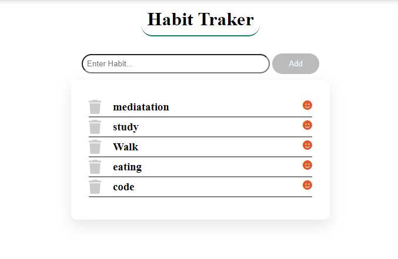

# Habit-Traker-App
You cannot able to keep your habit or want to create new habit.
Then try this amazing app Habit Tracker

A basic Habit Tracking System. Tech Stack : HTML, CSS, JS, Node.js

### Home :



### Habit :


## Technology Stack
- EJS
- SCSS
- NodeJS
- Express
- Mongodb

## How-To-Use

- Clone this project
- Start by installing npm and mongoDB if you don't have them already.
- Run the Mongo Server.
- Navigate to Project Directory
    ```
    cd Habit-Traker-App
    ```
- run following commands :
    ```
    npm install 
    ```
    ```
    npm start
    ```
## Basic-Features
- Home page includes all the habits you have added. You can Add or Delete any habit from here.
- Habits page here you can mark a particular habit for a date marked or not here you can also search by dates.
   
## Directory Structure and flow of The Code
This code follows MVC pattern and hence everything is differentiated and well managed:

    Habit_tracker
        |   .gitignore
        |   home.PNG
        |   index.js
        |   package-lock.json
        |   package.json
        |   Readme.md
        |   rotine.PNG
        |
        +---assets
        |   +---css
        |   |       home.css
        |   |       _header.css
        |   |
        |   \---js
        |           habit.js
        |           home.js
        |
        +---config
        |       mongoose.js
        |
        +---controllers
        |       homeControllers.js
        |
        +---models
        |       habit.js
        |       habitDates.js
        |
        +---routes
        |       index.js
        |
        \---views
                habit.ejs
                home.ejs
                layout.ejs
                _header.ejs


Happy Coding :)
